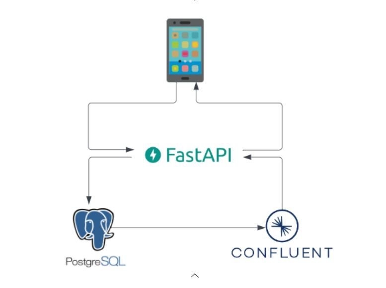
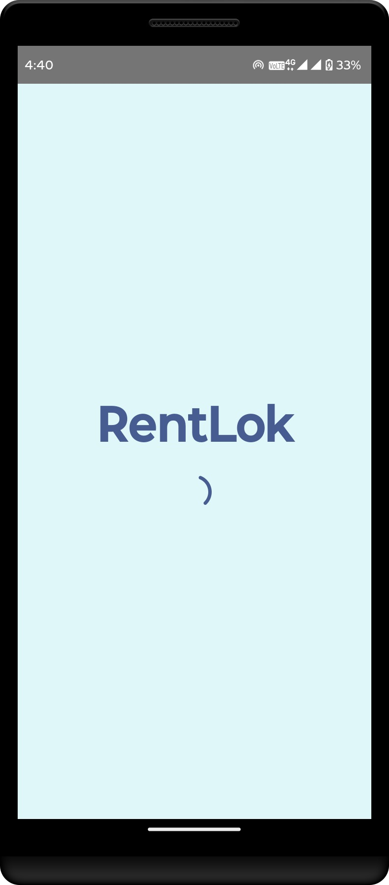
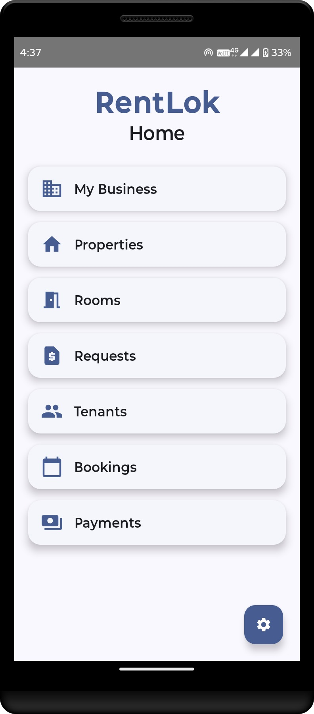

# 📱 RentLok: Rental Management System

**RentLok** is a rental management solution designed to streamline the day-to-day operations of property managers. It enables easy tracking of rooms, bookings, payments, and tenant details through a modern Android mobile app backed by a robust data pipeline using PostgreSQL and Confluent Kafka.

This project demonstrates a real-time, event-driven architecture where property and room data is captured through a mobile app, stored in PostgreSQL, and processed asynchronously via Kafka. FastAPI serves as the middleware to connect the app with the database and Kafka topics.

---

## ✅ Features

### 📲 Mobile App (Android)
- Add/manage properties & rooms
- Track room availability & inquiries
- Record tenant bookings & payments
- View real-time operational metrics

### 🛠️ Backend Stack
| Component       | Role                                                                 |
|-----------------|----------------------------------------------------------------------|
| **PostgreSQL**  | Central transactional database for rental/operational data           |
| **Confluent Kafka** | Real-time event streaming for live updates (vacancies, inquiries, etc.) |
| **FastAPI**     | Middleware connecting app ↔ database ↔ Kafka   

---
## 🔧 System Architecture Diagram

  

1. **Mobile App** → FastAPI (REST calls)
2. **FastAPI** → PostgreSQL (CRUD operations)
3. **PostgreSQL** → Kafka (publishing events)
4. **Kafka** → FastAPI (real-time stats)
5. **FastAPI** → Mobile App (real-time updates via consumer)

## 📱 Android App: Home Screen

The **RentLok** Android app provides a clean and intuitive user interface for property managers to efficiently navigate the system.

### Home Screen Overview
<table>
  <tr>
    <td></td>
    <td style="padding-left;"></td>
  </tr>
</table>

The **Home** screen acts as the central hub, offering quick access to the core modules of the RentLok system:

| Feature          | Description                                                                 |
|------------------|-----------------------------------------------------------------------------|
| 🏢 **My Business** | Real-time dashboard showing vacancies and daily/monthly requests via Kafka |
| 🏠 **Properties**   | Manage property listings, add new properties, and view details             |
| 🚪 **Rooms**        | Add rooms to properties, set availability, and manage room metadata        |
| 💵 **Requests**     | View and handle incoming inquiries or service requests                     |
| 👥 **Tenants**      | Maintain tenant records and history                                        |
| 📅 **Bookings**     | Create, view, and manage tenant bookings and stay durations                |
| 💰 **Payments**     | Log and track rent payments, view history, and check dues                  |

The settings icon ⚙️ at the bottom-right provides access to configuration and future customization options.

This modular approach ensures each function is logically grouped, enabling a user-friendly experience for non-technical users like landlords and rental agents.

## ⚙️ Backend: FastAPI Services

The backend is built using **FastAPI**, serving as the core middleware for handling RESTful API requests between the Android app, PostgreSQL, and Kafka.

---

### 🧩 Service 1: Android App ↔ PostgreSQL

This FastAPI script handles all database interactions and core business logic:

- CRUD operations for properties, rooms, tenants, bookings, and payments  
- Data validation and serialization  
- Request/response schema handling using **Pydantic**  
- PostgreSQL connection management using **SQLAlchemy**

📄 **Script:** [app_postgres_service.py](Backend/app_postgres_service.py)  
This service ensures reliable data persistence for the rental system.

### 🔁 Service 2: Android App ↔ Kafka (Confluent Platform)

This FastAPI service connects the Android app to Confluent Kafka using **ksqlDB queries** to serve real-time operational metrics through REST APIs.

- Serves live stats like room vacancies and inquiry counts using ksqlDB queries  
- Powers the "My Business" dashboard in the Android app  
- Uses HTTP-based integration with **Confluent ksqlDB REST API**  
- Provides endpoints to fetch daily, monthly, and current metrics from Kafka streams

📄 **Script:** [app_kafka_metrics_service.py](Backend/app_kafka_metrics_service.py)  
This approach allows your app to consume Kafka stream data without needing a direct Kafka consumer — simplifying real-time integration using HTTP.

## Stay Tuned still work in progress.

