

  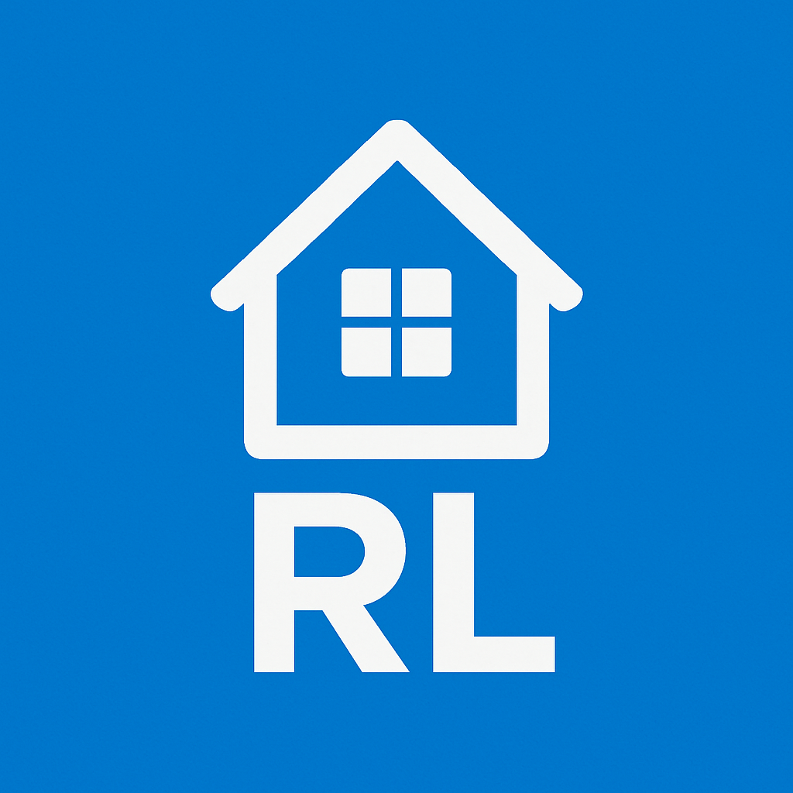

# 📱 RentLok: Rental Management System (Version 1.0)

**RentLok** is a rental management solution designed to streamline the day-to-day operations of property managers. It enables easy tracking of rooms, bookings, payments, and tenant details through a modern Android mobile app backed by a robust data pipeline using PostgreSQL and Confluent Kafka.

This project demonstrates a real-time, event-driven architecture where property and room data is captured through a mobile app, stored in PostgreSQL, and processed asynchronously via Kafka. FastAPI serves as the middleware to connect the app with the database and Kafka topics.

---

## ✅ Features

### 📲 Mobile App (Android)
- Add/manage properties & rooms
- Track room availability & inquiries
- Record tenant bookings & payments
- View real-time operational metrics

### 🛠️ Backend Stack
| Component       | Role                                                                 |
|-----------------|----------------------------------------------------------------------|
| **PostgreSQL**  | Central transactional database for rental/operational data           |
| **Confluent Kafka** | Real-time event streaming for live updates (vacancies, inquiries, etc.) |
| **FastAPI**     | Middleware connecting app ↔ database ↔ Kafka   

---
## 🔧 System Architecture Diagram

  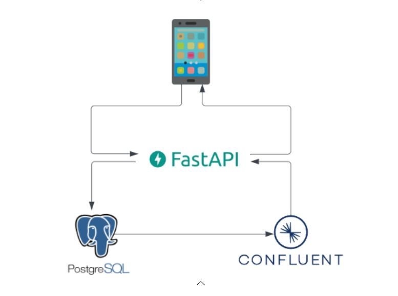

1. **Mobile App** → FastAPI (REST calls)
2. **FastAPI** → PostgreSQL (CRUD operations)
3. **PostgreSQL** → Kafka (publishing events)
4. **Kafka** → FastAPI (real-time stats)
5. **FastAPI** → Mobile App (real-time updates via consumer)

## 📱 Android App: Home Screen

The **RentLok** Android app provides a clean and intuitive user interface for property managers to efficiently navigate the system.

### Home Screen Overview
<table>
  <tr>
    <td></td>
    <td style="padding-left;">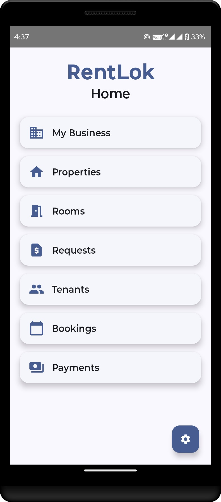</td>
  </tr>
</table>

The **Home** screen acts as the central hub, offering quick access to the core modules of the RentLok system:

| Feature          | Description                                                                 |
|------------------|-----------------------------------------------------------------------------|
| 🏢 **My Business** | Real-time dashboard showing vacancies and daily/monthly requests via Kafka |
| 🏠 **Properties**   | Manage property listings, add new properties, and view details             |
| 🚪 **Rooms**        | Add rooms to properties, set availability, and manage room metadata        |
| 💵 **Requests**     | View and handle incoming inquiries or service requests                     |
| 👥 **Tenants**      | Maintain tenant records and history                                        |
| 📅 **Bookings**     | Create, view, and manage tenant bookings and stay durations                |
| 💰 **Payments**     | Log and track rent payments, view history, and check dues                  |

## 1) My Business:

Get a real-time overview of your rental business powered by Confluent Kafka integration.

<table>
  <tr>
    <td>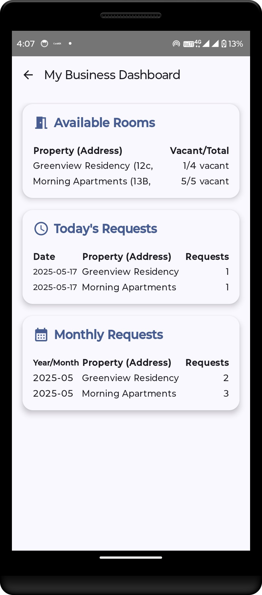</td>
  </tr>
</table>

### 📊 Real-time Insights

- **Available Rooms** – Live count of vacant rooms per property  
- **Today's Requests** – Displays how many room rental requests were received today for each property  
- **Monthly Requests** – Aggregates the total number of requests per property for the current month  

### 🛰️ Kafka Integration

- Powered by **Confluent Kafka** to stream real-time updates from all properties  
- Kafka topics are updated as tenants request rooms or as room statuses change (e.g., from vacant to occupied)

### 🔍 Use Case

Helps property managers monitor:

- Occupancy status in real-time  
- Incoming rental demand trends  
- Property-wise request load across different timeframes (daily, monthly)

> The dashboard ensures you stay informed and responsive to rental activity as it happens.

## 2) Properties: 

Manage rental properties directly from the mobile app.
<table>
  <tr>
    <td>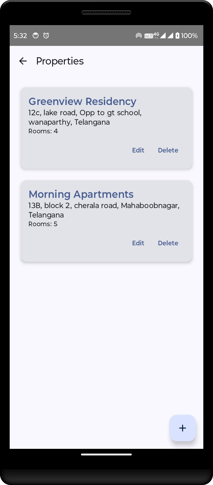</td>
    <td style="padding-left;">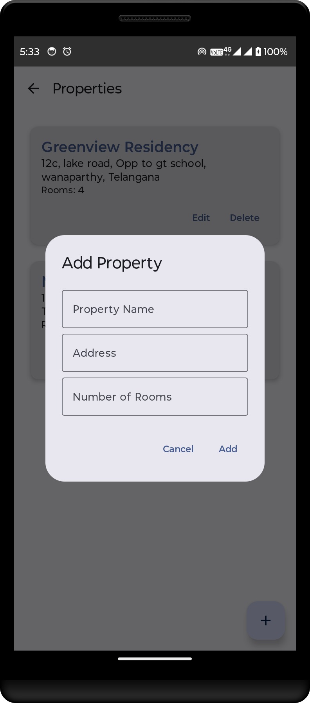</td>
  </tr>
</table>

### 📲 Screen

- **View Properties** – Displays all saved properties with basic details
- **Add Property** – Input property name, address, and number of rooms

### 🔧 CRUD Operations

- ✅ **Create** → Add new property  
- 📖 **Read** → View all properties  
- 📝 **Update** → Update property info  
- ❌ **Delete** → Mark property as inactive

## 3) Rooms:

Add and manage rooms under each property directly from the mobile app.
<table>
  <tr>
    <td>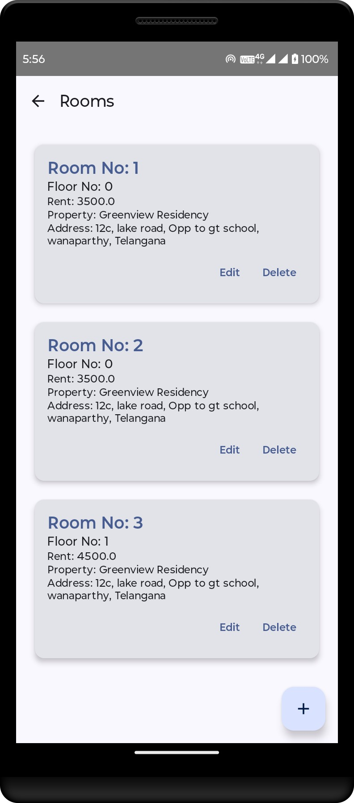</td>
    <td>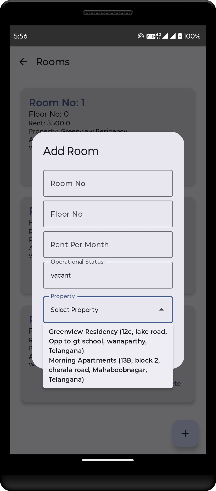</td>
  </tr>
</table>

### 📲 Screen

- **View Rooms** – Displays all rooms under a selected property
- **Add Room** – Input room number, monthly rent, and availability status

### 🔧 CRUD Operations

- ✅ **Create** → Add new room under a selected property  
- 📖 **Read** → View rooms for a selected property  
- 📝 **Update** → Update room details  
- ❌ **Delete** → Mark room as inactive

## 4) Requests:

Track and manage room rental inquiries for each property from the mobile app.

<table>
  <tr>
    <td>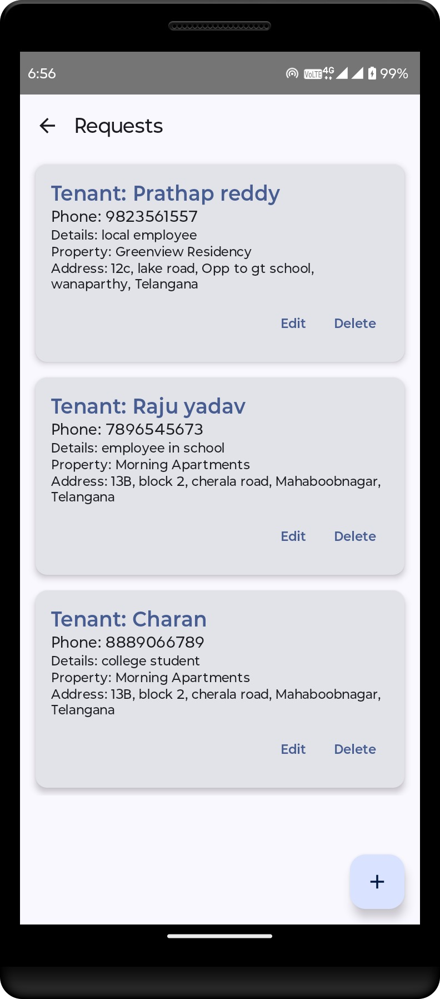</td>
    <td>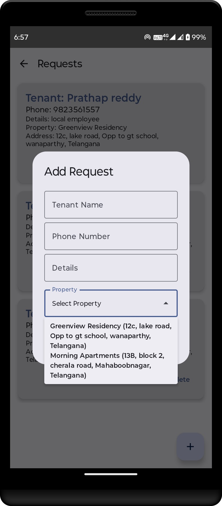</td>
  </tr>
</table>

### 📲 Screen

- **View Requests** – Displays rental inquiries submitted for a selected property
- **Add Request** – Capture name, contact, and inquiry notes from interested tenants

### 🔧 CRUD Operations

- ✅ **Create** → Submit a new room inquiry  
- 📖 **Read** → View all rental requests for a property  
- 📝 **Update** → (Planned) Update request status or details  
- ❌ **Delete** → (Planned) Remove closed or invalid requests

## 5) Tenants:

Manage tenant details directly within the mobile app.

<table>
  <tr>
    <td>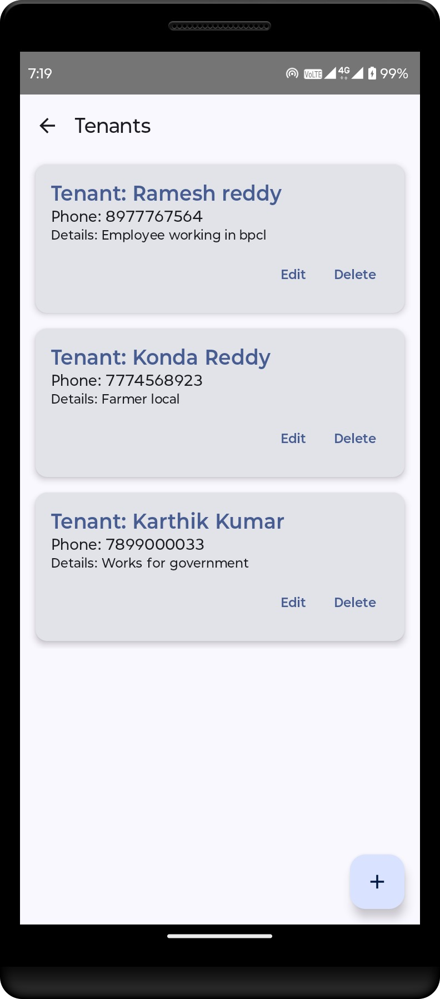</td>
    <td>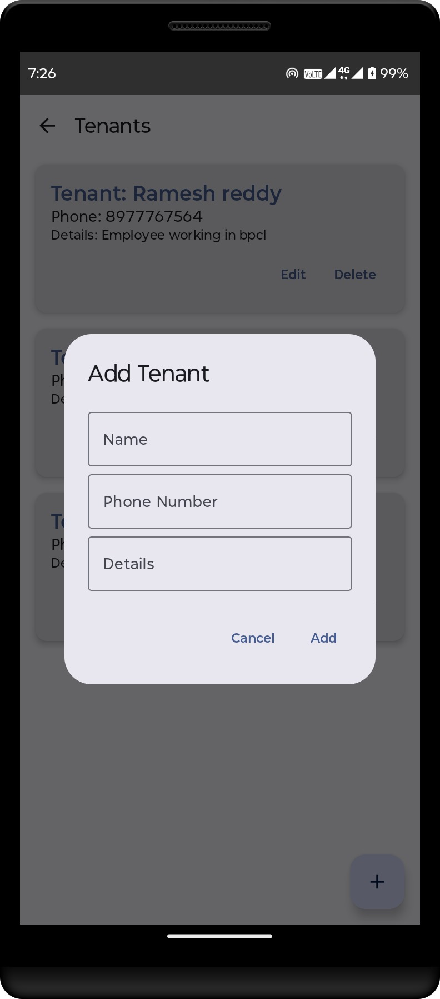</td>
  </tr>
</table>

### 📲 Screen

- **View Tenants** – Displays all active tenants.
- **Add Tenant** – Input tenant name, contact info, room number, and check-in date

### 🔧 CRUD Operations

- ✅ **Create** → Add a new tenant to a room  
- 📖 **Read** → View tenant list for a property  
- 📝 **Update** → Update tenant details  
- ❌ **Delete** → Mark tenant as vacated or remove record

## 6) Bookings:

Track and manage room bookings for properties directly within the mobile app.

<table>
  <tr>
    <td>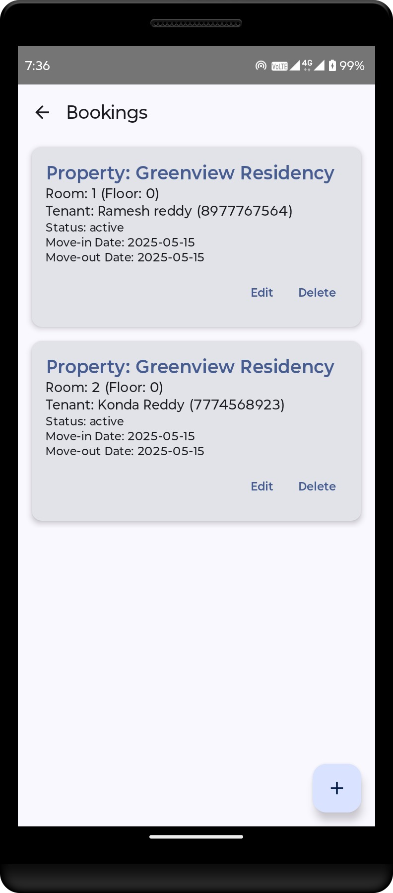</td>
    <td>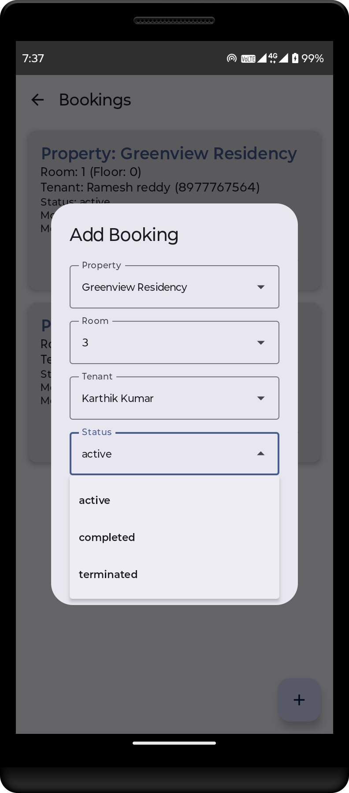</td>
  </tr>
</table>

### 📲 Screen

- **View Bookings** – Lists all current and past room bookings for a property
- **Add Booking** – Select room and enter tenant details along with check-in/check-out dates

### 🔧 CRUD Operations

- ✅ **Create** → Record a new booking for a room  
- 📖 **Read** → View all bookings under a property  
- 📝 **Update** → Modify booking dates or details  
- ❌ **Delete** → Cancel or archive a booking

## 7) Payments:

Record and view rental payments made by tenants directly from the mobile app.

<table>
  <tr>
    <td>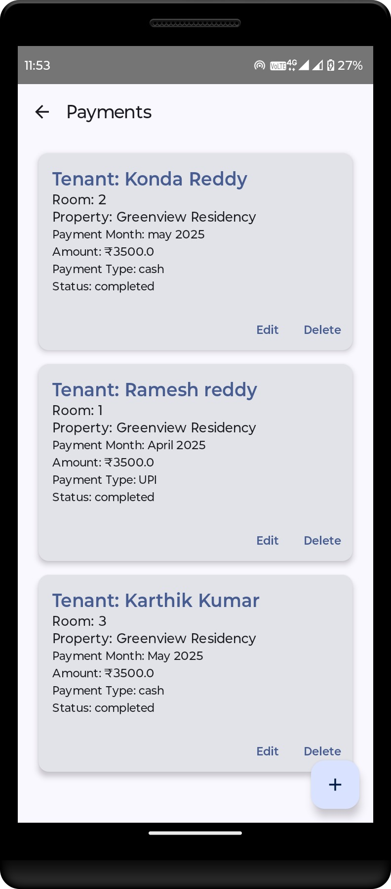</td>
    <td>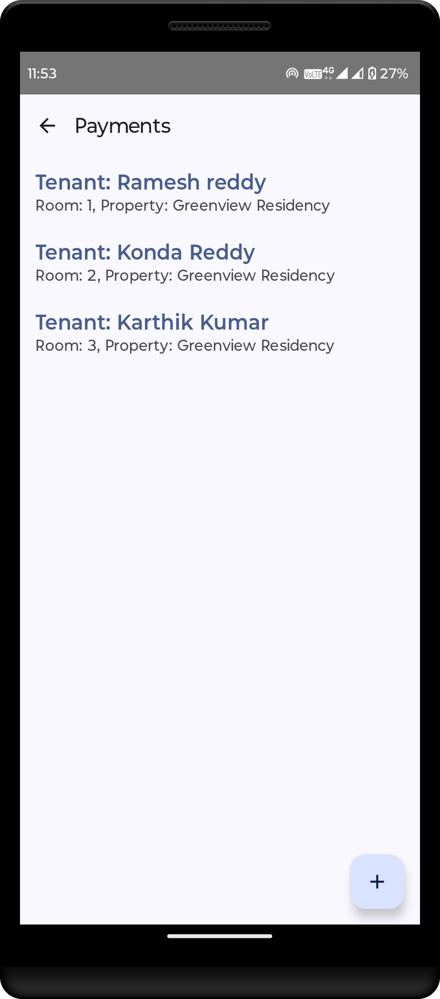</td>
    <td>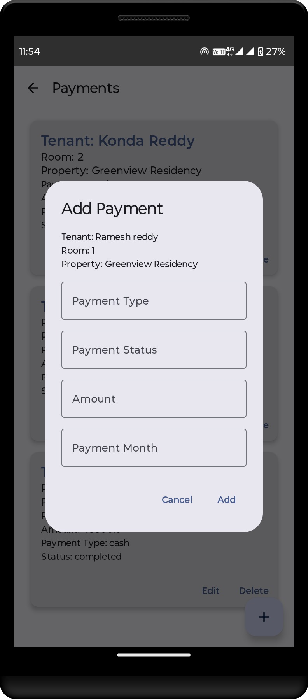</td>
  </tr>
</table>

### 📲 Screen

- **View Payments** – Shows a list of all payments made for a specific room or tenant
- **Add Payment** – Enter payment amount, method, and date for a selected tenant

### 🔧 CRUD Operations

- ✅ **Create** → Add a new payment entry  
- 📖 **Read** → View payment history by room or tenant  
- 📝 **Update** → Edit incorrect payment entries  
- ❌ **Delete** → Remove duplicate or invalid payment entries

The settings icon ⚙️ at the bottom-right provides access to configuration and future customization options.

This modular approach ensures each function is logically grouped, enabling a user-friendly experience for non-technical users like landlords and rental agents.

---

## ⚙️ Backend: FastAPI Services

The backend is built using **FastAPI**, serving as the core middleware for handling RESTful API requests between the Android app, PostgreSQL, and Kafka.

---

### 🧩 Service 1: Android App ↔ PostgreSQL

This FastAPI script handles all database interactions and core business logic:

- CRUD operations for properties, rooms, tenants, bookings, and payments  
- Data validation and serialization  
- Request/response schema handling using **Pydantic**  
- PostgreSQL connection management using **SQLAlchemy**

📄 **Script:** [app_postgres_service.py](Backend/app_postgres_service.py)  
This service ensures reliable data persistence for the rental system.

### 🔁 Service 2: Android App ↔ Kafka (Confluent Platform)

This FastAPI service connects the Android app to Confluent Kafka using **ksqlDB queries** to serve real-time operational metrics through REST APIs.

- Serves live stats like room vacancies and inquiry counts using ksqlDB queries  
- Powers the "My Business" dashboard in the Android app  
- Uses HTTP-based integration with **Confluent ksqlDB REST API**  
- Provides endpoints to fetch daily, monthly, and current metrics from Kafka streams

📄 **Script:** [app_kafka_metrics_service.py](Backend/app_kafka_metrics_service.py)  
This approach allows your app to consume Kafka stream data without needing a direct Kafka consumer — simplifying real-time integration using HTTP.

---

## 🗄️ Storage: PostgreSQL

The **PostgreSQL** database is the primary data store for RentLok, supporting persistent, consistent, and structured storage of all rental business operations. It manages properties, rooms, tenants, bookings, payments, and inquiry requests submitted through the Android app. Every change to the business is captured as a structured record in these normalized tables.

---
### 🧩 ERD Diagram

  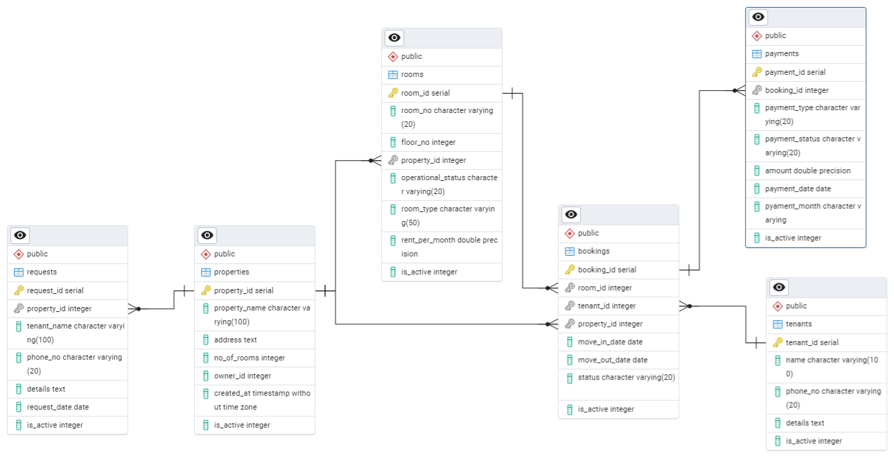

### 🗃️ Database Tables Overview

| Table Name     | Description                                                                 |
|----------------|-----------------------------------------------------------------------------|
| `properties`   | Stores property-level details like name, address, total rooms, and owner ID |
| `rooms`        | Lists rooms per property with floor info, type, rent, and status            |
| `tenants`      | Stores tenant details like name, phone number, and profile description      |
| `bookings`     | Tracks active room bookings by linking tenants, rooms, and properties       |
| `payments`     | Stores rent payment records, status, amount, and related booking info       |
| `requests`     | Captures property inquiry requests from new or prospective tenants          |

## 🔧 Database Index Optimization

To enhance query performance on PostgreSQL, especially for frequently accessed and filtered columns, we introduced targeted indexing strategies across key tables:

### ✅ Index Strategy

- **Single-column indexes** (e.g., `property_id`, `user_id`, `tenant_id`) use the `HASH` index method for faster lookups on equality conditions (`=`).
- **Composite indexes** (e.g., `room_id + property_id`, `tenant_id + room_id`) use the default `BTREE` method, as PostgreSQL does **not support multicolumn `HASH` indexes**.

### 📈 Performance Benefits

- Speeds up **backend API responses** by optimizing equality-based filtering and JOINs in PostgreSQL.
- Ensures **low-latency data access** from the Android app through FastAPI endpoints.
- Minimizes full-table scans and improves scalability as the dataset grows.

> ⚠️ PostgreSQL limitation: `HASH` indexes can only be created on **single columns**. For multi-column queries, `BTREE` remains the optimal and supported strategy.

### 📄 SQL Script

The index creation script is included in the repo:  
➡️ [`postgresql_indexes.sql`](Backend/postgresql_indexes.sql)

---

## 🌀 Confluent Kafka Integration

The RentLog application uses **Confluent Kafka** with **ksqlDB** for real-time streaming, transformation, and aggregation of property rental data. This enables dynamic insights on tenant requests and property vacancies directly in the dashboard.

---
### 🔌 Kafka Connect

- **Connector**: Kafka Connect JDBC Source Connector
- **Mode**: Incrementing (based on primary key)
- **Source**: PostgreSQL tables – `requests`, `rooms`, `properties`
- **Topics Produced**:
  - `rentlok-requests`
  - `rentlok-rooms`
  - `rentlok-properties`
- **Respective Connector Config Files** are available in repo : [Connectors](Connectors) 

### 🔄 Stream Processing with ksqlDB

> ksqlDB is used for transforming source Kafka topics into meaningful, queryable **streams** and **tables**.

### 📷 Flow Diagram

  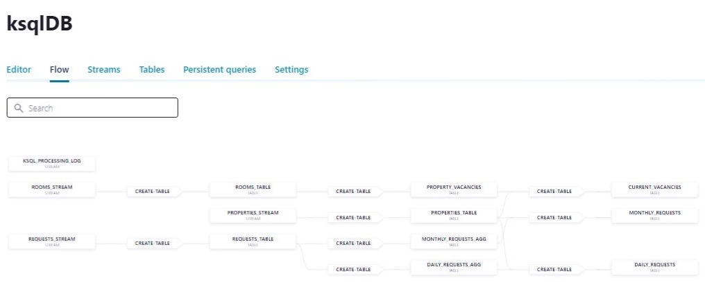

#### ✅ STREAMS Defined

| Stream Name       | Source Topic         | Purpose                                |
|-------------------|----------------------|----------------------------------------|
| `requests_stream` | `rentlok-requests`   | Raw request data                       |
| `rooms_stream`    | `rentlok-rooms`      | Raw room metadata                      |
| `properties_stream`| `rentlok-properties`| Raw property information               |

#### 📊 TABLES Created & Aggregations

| Table Name              | Description                                                      |
|-------------------------|------------------------------------------------------------------|
| `requests_table`        | Latest version of each request                                   |
| `properties_table`      | Latest version of each property                                  |
| `rooms_table`           | Latest room details per room ID                                  |
| `property_vacancies`    | Total vacant rooms per property                                  |
| `current_vacancies`     | Joined with property info; filters active properties             |
| `daily_requests_agg`    | Aggregates active requests per property per date                 |
| `monthly_requests_agg`  | Aggregates active requests per property per month                |
| `daily_requests`        | Joins `daily_requests_agg` with property info (for today's date) |
| `monthly_requests`      | Joins `monthly_requests_agg` with property info (for current month) |

#### 🗂️ Script File
All ksqlDB stream and table creation commands are included in the attached file:
📄[ksqldb_tables_script](Backend/ksqldb_tables_script.txt)

---

## 📌 Summary & Final Notes

**RentLok** offers an end-to-end solution for rental property management using modern technologies like **PostgreSQL**, **FastAPI**, and **Confluent Kafka**, integrated with a native **Android frontend**.

> ⚠️ Currently, this system is built for **single-user access** and does not support multi-user logins or security roles.  
> Future versions will include:
> - Role-based access controls  
> - User authentication and authorization  
> - Encrypted communications  
> - Richer tenant and landlord app features  

---

## 📬 Connect with Me

Feel free to connect for feedback, improvements, or collaboration opportunities.

- 💼 [LinkedIn](https://www.linkedin.com/in/eegapuri-lokeshwar-reddy-281327308)
- 💻 [GitHub](https://github.com/elreddy)
- 📧 Email: elokesh4292@gmail.com

